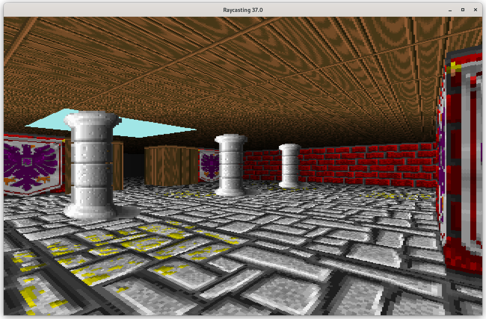
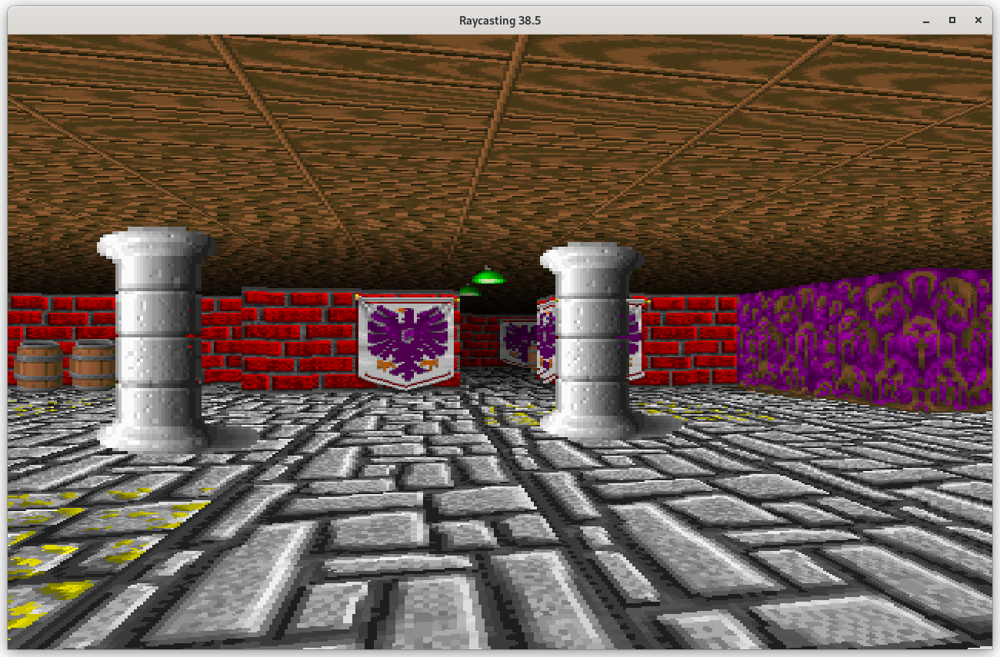
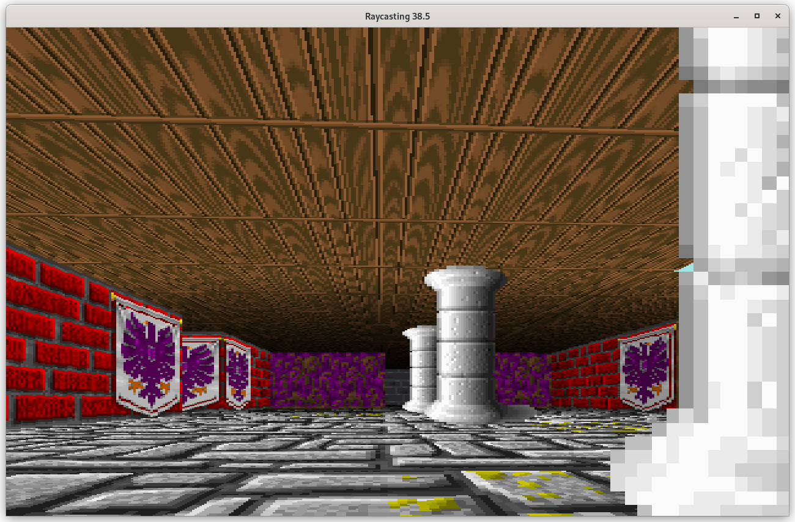

# Python-Raycast
A simple raycasting engine in python using pygame graphics framework and numpy modules

## Raycasting Features
- Textured raycasting of walls using DDA algorithm
- Textured floor- and ceiling-casting using horizontal scanlines
- Sprite-casting

## Engine features
- Controllable camera with fov, height and tilt settings
- Editable grid-based levels
- Binding keys to actions
- Custom, dynamic drawables (inherit Drawable class)

## Screenshots

## Copyright
Most textured and sprites used in this demo are from Wolfenstein 3D game (copyright by Id Software)
